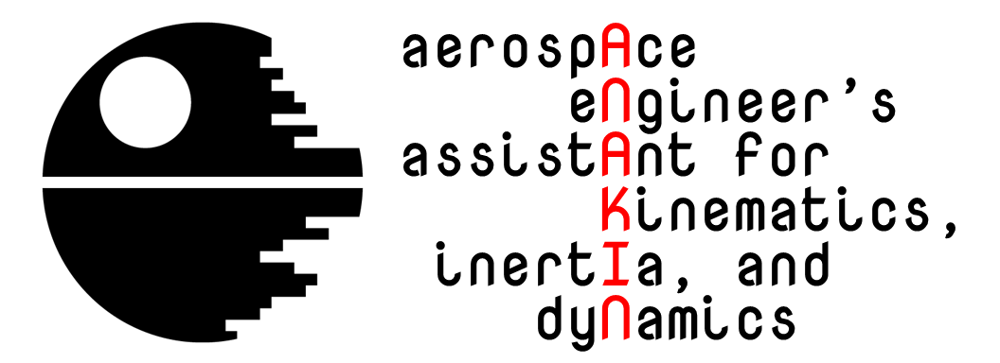

# Anakin

[](https://zenodo.org/badge/latestdoi/143483510)

**Anakin** (Aerospace eNgineer's Assistant for Kinematics, Inertia and dyNamics)
is a Matlab framework that defines a number of classes to facilitate modeling and
solving Classical Mechanics problems in Aerospace Engineering and other disciplines.



## Installation

Installation requires simply that you
[download Anakin](https://github.com/mariomerinomartinez/anakin/archive/master.zip)
and add the base directory to your Matlab path.

### Dependencies

A recent version of Matlab is needed to run the code (R2016a or newer). The
[Symbolic Math Toolbox](https://www.mathworks.com/products/symbolic.html) is
required to use most of the functionality.
Version R2018a or newer is recommended as it includes support for
the example live scripts.

## Quick usage guide

Anakin documentation can be found in the `/docs` subdirectory. A live script is
provided for each Anakin class, illustrating its usage and capabilities.
The `/problems` subdirectory includes live scripts that solve the problems
of the course 'Mechanics Applied to Aerospace Engineering' of the BSc program
in Aerospace Engineering at UC3M.

To use Anakin, t is recommended that you first import the Anakin package with

```Matlab
import anakin.*
```

If you do not, then you will need to access
all classes with the `anakin.` prefix,
e.g.  `anakin.tensor`.

Currently Anakin defines the following classes:

* `tensor`: genral class for scalars, vectors, 2nd-order tensors, and more
* `basis`: vector bases
* `frame`: reference frames
* `point`: geometric points
* `particle`: point particles 

The description of the properties and methods of each class is included in the
header comments of each code file.

### Testing

Unit tests are found in the `/test` subdirectory. After adding the Anakin package
to your Matlab path, you can run all tests by executing `runtests` from this
subdirectory.

## Contributing

If you have any comments for improvement or
are interested in contributing to the continued
development of this or any of my other codes, please
[contact us](mailto:mario.merino@uc3m.es).

## Acknowledging

This program is the result of substantial effort at the Aerospace Engineering
department of Universidad Carlos III de Madrid. It is released as open
source in the hope that it will be useful to other people. If you find it
useful and/or use it in any of your works, we kindly ask you to acknowledge it
by citing this repository.
 
Mario Merino (2018). [https://github.com/uc3m-aerospace/anakin](https://github.com/uc3m-aerospace/anakin): First release [DOI:10.5281/zenodo.2533336](https://doi.org/10.5281/zenodo.2533336)

## License

Copyright (c) 2018 Mario Merino.
The software is released as open source under the [MIT License](LICENSE.md).
